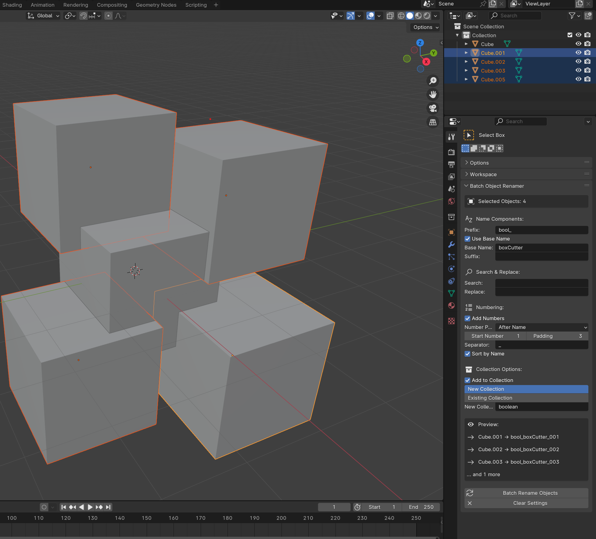

# BL_batch_rename

Blender plugin to batch rename objects and add prefixes, postfixes, numbering, padding and seperators
Simplifies the process of renaming objects in bulk and increases productivity while working with large scenes in Blender.

In the future will add the ability to automatically add renamed objects to new group

## Installation
    1. Download the batch_rename.py file.
    2. In Blender, go to Edit > Preferences > Add-ons.
    3. Click on Install and select the batch_rename.py file.
    4. Enable the plugin by checking the checkbox next to it in the Add-ons list.

## Usage
    1.Select objects in the 3D Viewport
    2.Open the Sidebar (N key) and go to the Tool tab
    3.Find the "Batch Object Renamer" panel
    4.Configure your naming options
    5.Click "Batch Rename Objects" to apply

## Example

**Before**: `Cube`, `Sphere`, `Cylinder`

**After applying settings**:
- Prefix: "My_"
- Suffix: "_Model"
- Numbering: Enabled with padding 2

**Result**: `My_Cube_01_Model`, `My_Sphere_02_Model`, `My_Cylinder_03_Model`

## Dependencies
    -Blender 4 and up

## Contributing
    -Fork the repository.
    -Create a new branch.
    -Make your changes.
    -Submit a pull request.

## License
This project is licensed under the MIT License - see the LICENSE file for details.